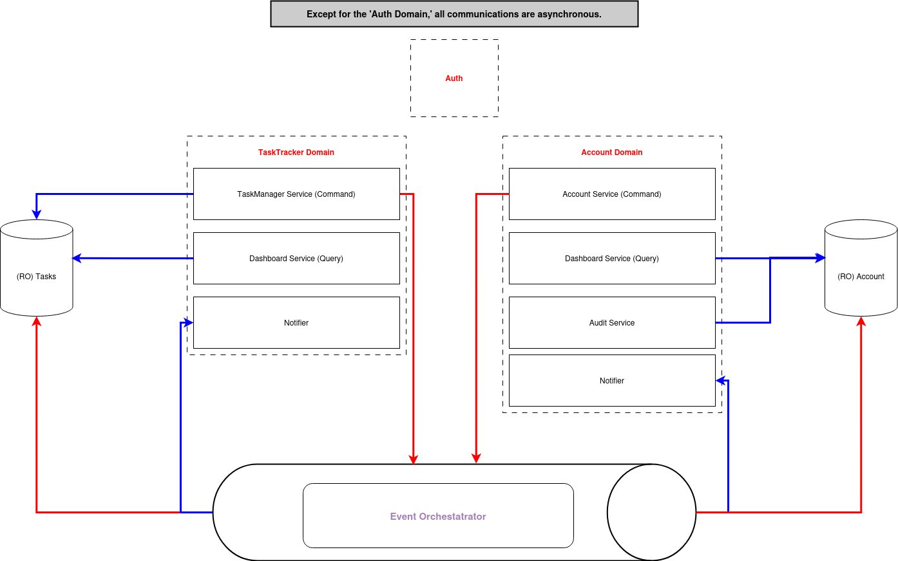

# Домашка к курсу ["Асинхронная архитектура" by ToughDevSchool](https://tough-dev.school/architecture)

## Architecture

| Domain      | Services                                                                                                         | 
|-------------|------------------------------------------------------------------------------------------------------------------|
| Auth        | 1. Auth-Service                                                                                                  |
| TaskTracker | 1. Manage Tasks (Command)   2. Dashboard Service (Query)   3. Notifier                                   |
| Accounting  | 1. Account Service (Command)   2. Dashboard Service (Query)   3. Audit Service (Query)   4. Notifier |

Except Auth flow, all the communications between services are asynchronous

## Events By Domains

### Task Tracker

| Action                 | Actor            | Command          | Data                                    | Event           | Description |
|------------------------|------------------|------------------|-----------------------------------------|-----------------|-------------|
| Create a Task          | Anyone           | CreateTask       | `Task{Description, Status, Assignee}`   | Task.Created    |             |
| Resolve Task           | Anyone           | ChangeTaskStatus | `Task{TaskID, Status}`                  | Task.Resolved   |             |
| Assign Task            | Admin or Manager | AssignTasks      | `Task{TaskID, Status: Open, Assignee}`  | []Task.Assigned |             |
| (RM) Send Notification | Task.Changed     | -                | -                                       | -               |             |
| (RM) Get Dashboard     | Task.Changed     | -                | -                                       | -               |             |
    
### Accounting

| Action                                                  | Actor                | Command       | Data                         | Event                   | Description                                                                                                                                            |
|---------------------------------------------------------|----------------------|---------------|------------------------------|-------------------------|--------------------------------------------------------------------------------------------------------------------------------------------------------|
| Withdraw Money                                          | Task.Assigned        | WithdrawMoney | `Account{UserID, MoneyDiff}` | Account.BalanceChanged  |                                                                                                                                                        |
| Deposit Money                                           | Task.Resolved        | DepositMoney  | `Account{UserID, MoneyDiff}` | Account.BalanceChanged  |                                                                                                                                                        |
| Reset Balance                                           | Cron                 | ResetBalance  |                              | Account.BalanceReset    | Reset balance all of the workers at the end of the day                                                                                                 |
| Commit Payout                                           | Account.BalanceReset | CommitPayout  | `Account{UserID}`            | Account.PayoutCommitted |                                                                                                                                                        |
| (RM) Get Daily Balance                                  | Worker               |               |                              |                         |                                                                                                                                                        |
| (RM) Get Daily Balance                                  | Manager              |               |                              |                         |                                                                                                                                                        |
| (RM) Get Daily Balance                                  | Top-Manager          |               |                              |                         |                                                                                                                                                        |
| (RM) Get The Most Expensive Task For [Day, Month, Year] | Top-Manager          |               |                              |                         | 03.03 - самая дорогая задача - 28$; 02.03 - самая дорогая задача - 38$; 01.03 - самая дорогая задача - 23$; 01-03 марта - самая дорогая задача - 38$   |
| (RM) Send Daily Balance Notification                    | Cron                 |               |                              |                         |                                                                                                                                                        |

## Domains

